# CampusNest

### Verified student accommodation, smarter discovery, and transparent property verification.

CampusNest is a full-stack student accommodation platform built to help students discover suitable housing near their college, compare real accommodation costs, evaluate availability, and inspect property verification records.

The platform connects three roles:

- **Students** — discover, search, compare, and receive personalized property recommendations.
- **Listers** — create and manage accommodation listings, maintain occupancy, and submit properties for verification.
- **Admins** — operate the marketplace, review listings, approve/reject verification requests, inspect platform data, and monitor verification and system activity.

---

## Table of Contents

- [What is CampusNest?](#what-is-campusnest)
- [The Problem](#the-problem)
- [The Solution](#the-solution)
- [Key Properties](#key-properties)
- [Architecture](#architecture)
- [Student Workflow](#student-workflow)
- [Lister Workflow](#lister-workflow)
- [Admin Workflow](#admin-workflow)
- [Role & Access Control](#role--access-control)
- [Key Features](#key-features)
- [Property Verification](#property-verification)
- [Smart Recommendations](#smart-recommendations)
- [Authentication & Authorization](#authentication--authorization)
- [Data & Privacy](#data--privacy)
- [Tech Stack](#tech-stack)
- [Prerequisites](#prerequisites)
- [Local Development](#local-development)
- [Environment Variables](#environment-variables)
- [API Reference](#api-reference)
- [Project Structure](#project-structure)
- [How It Works](#how-it-works)
- [Database Model](#database-model)
- [Deployment](#deployment)
- [Recommended Showcase Flow](#recommended-showcase-flow)
- [Project Status](#project-status)
- [Contributing](#contributing)
- [License](#license)

---

## What is CampusNest?

CampusNest is a student accommodation marketplace designed around **discovery, transparency, availability, and verification**.

Instead of treating accommodation as a simple list of properties, CampusNest combines:

- student preferences
- property characteristics
- effective monthly cost
- distance and commute information
- availability
- facilities
- deterministic recommendations
- property verification records

The platform is implemented as a Next.js frontend backed by a Spring Boot REST API and PostgreSQL database.

---

## The Problem

Finding student accommodation often involves several disconnected problems:

- listings are spread across different platforms and channels
- pricing can hide additional monthly costs
- availability may be outdated
- students have difficulty comparing multiple properties
- proximity to campus is difficult to evaluate consistently
- property information may be difficult to trust
- listers need a structured way to manage listings
- platforms need a way to review and verify submitted properties

### The Solution

CampusNest creates a role-based accommodation marketplace:

```text
Student
  ↓
Discover → Search → Filter → Match → Compare → Verify

Lister
  ↓
Create → Manage → Submit → Verification → Maintain

Admin
  ↓
Review → Approve / Reject → Monitor → Audit → Operate
```

The result is a single workflow connecting students, property listers, and platform administrators.

---

## Key Properties

| Property | CampusNest Implementation |
|---|---|
| Student discovery | Verified and available property discovery |
| Search & filtering | Budget, locality, property type, and availability-aware search |
| Smart matching | Deterministic five-factor recommendation scoring |
| Comparison | Compare 2–3 properties against student preferences |
| Transparent pricing | Rent + food + electricity + Wi-Fi + maintenance |
| Live availability | Capacity, occupied beds, and available beds |
| Listing management | Lister-owned property creation, editing, and availability updates |
| Verification | Admin review, approval/rejection, verification records |
| Tamper evidence | SHA-256 verification record hashing |
| Blockchain | Optional Polygon Amoy transaction registration |
| Authentication | Stateless JWT authentication |
| Authorization | STUDENT / LISTER / ADMIN role-based access |
| Persistence | PostgreSQL |
| Schema migrations | Flyway |
| API documentation | Springdoc OpenAPI / Swagger UI |

---

# Architecture

CampusNest follows a layered full-stack architecture:

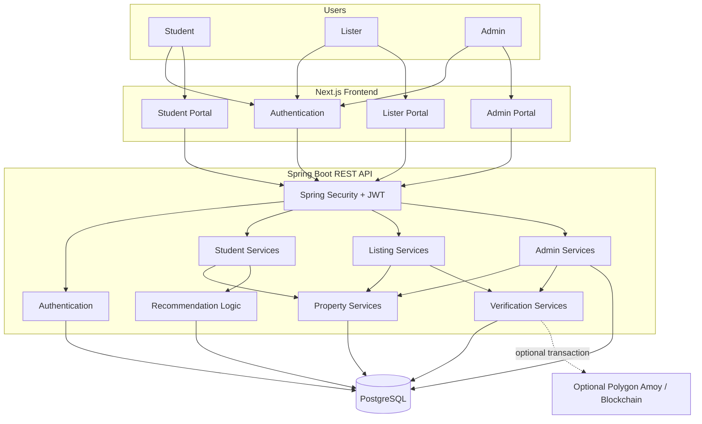

### Request flow

```text
Browser
   │
   ▼
Next.js Frontend
   │
   │ REST / JSON + JWT
   ▼
Spring Boot API
   │
   ├── Spring Security
   ├── Authentication
   ├── Student services
   ├── Lister services
   ├── Property services
   ├── Recommendation logic
   ├── Verification services
   └── Admin services
   │
   ▼
PostgreSQL
```

The backend uses a conventional:

**Controller → Service → Repository → Database**

request flow, with recommendation, availability, cost, verification, and optional blockchain logic layered into the relevant services.

---

# Student Workflow

The Student workflow is centered around finding accommodation that fits the student's actual requirements.

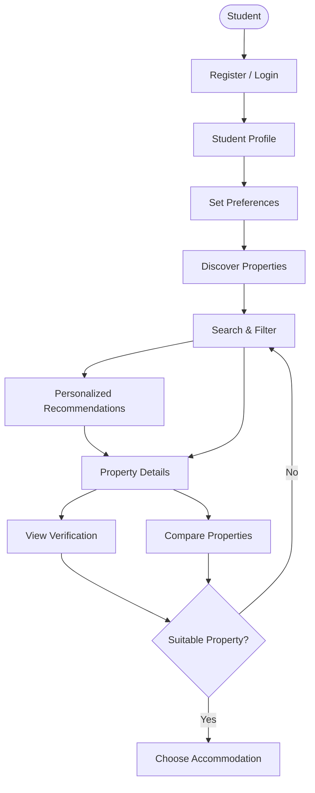

### 1. Register or Login

Students create an account or authenticate with an existing account.

A successful authentication returns a JWT used for protected API requests.

### 2. Complete the profile

The student can provide:

- college
- minimum budget
- maximum budget
- move-in date
- preferred locality
- accommodation type
- lifestyle tags

### 3. Discover and search

Students can browse verified and available properties and filter them by:

- minimum budget
- maximum budget
- locality
- property type

### 4. Recommendations

CampusNest evaluates available properties against the student's profile using a deterministic weighted scoring system.

### 5. Inspect and compare

Students can open detailed property information, inspect verification metadata, and compare between two and three properties.

---

# Lister Workflow

Listers manage accommodation listings and submit them for platform verification.

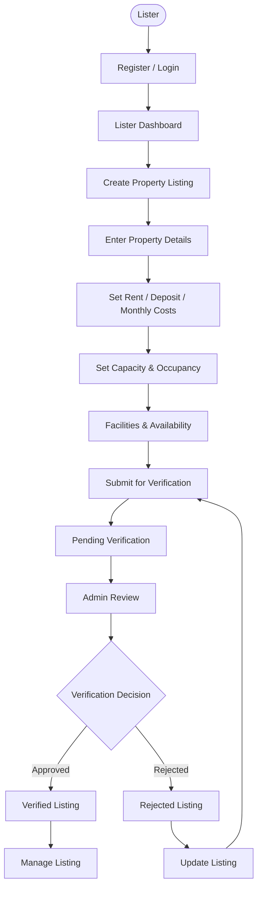

### Listing information

A listing can contain:

- property name
- property type
- address
- locality
- description
- latitude / longitude
- rent
- deposit
- food cost
- electricity cost
- Wi-Fi cost
- maintenance cost
- facilities
- distance from campus
- commute time
- commute mode
- capacity
- occupancy
- availability

### Availability

Listers can update occupied beds. CampusNest derives available capacity from the property's capacity and occupancy.

### Verification

New or previously rejected listings can be submitted for verification. The listing then enters the Admin verification workflow.

---

# Admin Workflow

CampusNest contains a dedicated administrative control center.

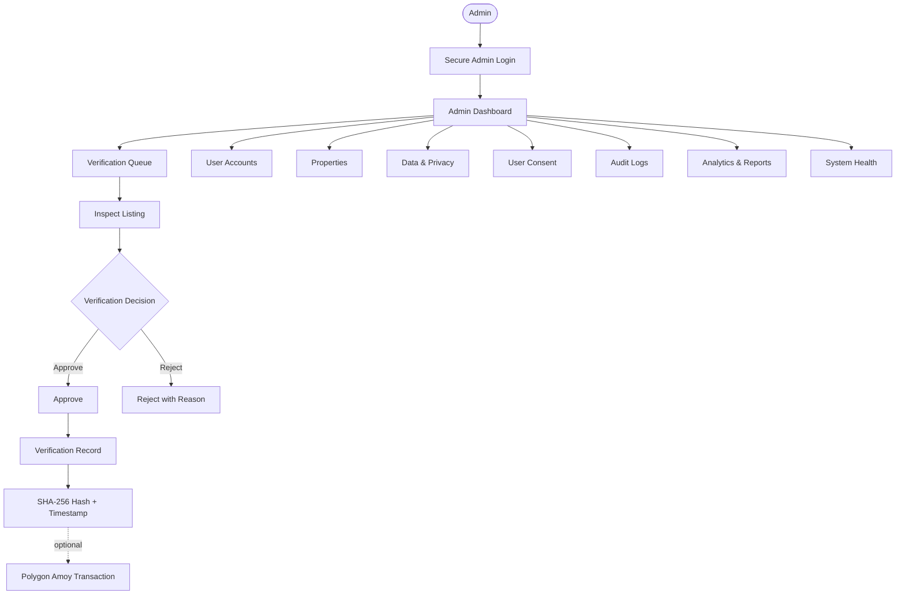

### Admin dashboard

The Admin dashboard exposes real database-derived operational information such as:

- student accounts
- lister accounts
- admin accounts
- total properties
- verified properties
- pending verification
- under-review verification
- rejected properties
- total capacity
- occupied beds
- available beds
- recent administrative activity

### Verification Center

Admins can:

1. view pending submissions
2. view all properties
3. mark a listing under review
4. approve a listing
5. reject a listing with a reason
6. create verification records
7. inspect verification hashes and blockchain transaction metadata where available

### User Accounts

The Admin console provides role-aware user information with masked contact information and profile details.

### Data & Privacy

The Admin portal groups platform information into:

- Public Listing Data
- User Identity & Authentication
- Student Preferences & Matching
- System Security & Audit Integrity

Sensitive authentication values are not exposed as raw credentials.

### User Consent

The current Admin implementation exposes consent-oriented records for data categories used by matching and listing verification.

### Audit Logs

The Admin console aggregates:

- property registration activity
- user registration activity
- property approval/rejection records
- verification metadata
- reviewer information

### Analytics & Reports

Current reports include:

- total properties
- verification rate
- average rent
- average effective monthly cost
- occupancy rate
- locality breakdown
- property type breakdown
- verification status breakdown

### System Health

The Admin system-health endpoint reports:

- backend status
- database status
- authentication status
- blockchain configuration status
- database latency
- total users
- total properties
- total verification records

---

# Role & Access Control

CampusNest separates the three platform roles.

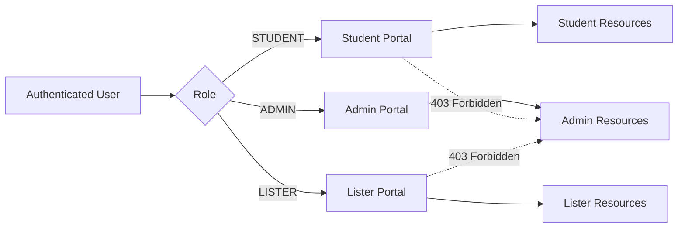

| Capability | Student | Lister | Admin |
|---|:---:|:---:|:---:|
| Register / Login | ✅ | ✅ | ✅ |
| Student profile | ✅ | — | 👁 |
| Discover properties | ✅ | — | 👁 |
| Search / Filter | ✅ | — | 👁 |
| Recommendations | ✅ | — | 👁 |
| Compare properties | ✅ | — | 👁 |
| Manage own listings | — | ✅ | 👁 |
| Update availability | — | ✅ | 👁 |
| Submit verification | — | ✅ | 👁 |
| Review verification | — | — | ✅ |
| User administration | — | — | ✅ |
| Property administration | — | Own | All |
| Data & Privacy | — | — | ✅ |
| Audit Logs | — | — | ✅ |
| Reports | — | — | ✅ |
| System Health | — | — | ✅ |

> **Important:** Hiding the Admin link in the frontend is not the security boundary. Spring Security protects `/admin/**` at the backend level with the `ADMIN` role.

---

# Admin Security Flow

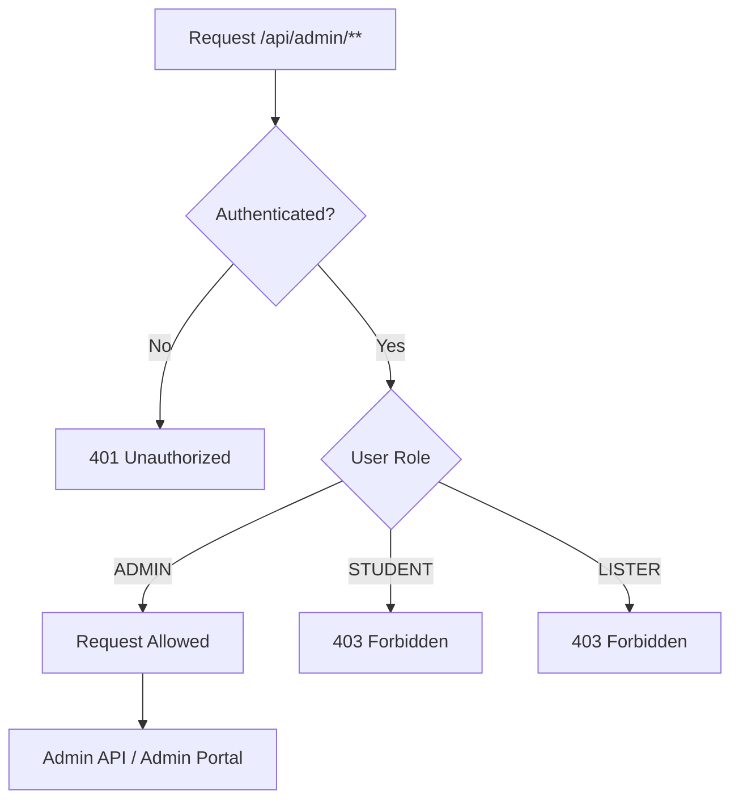

The backend security rules currently enforce:

```text
/api/auth/**              → Public
GET /api/verification/**  → Public
/api/admin/**             → ADMIN
/api/listings/**          → LISTER
/api/students/**          → STUDENT
/api/recommendations      → STUDENT
/api/properties/**        → STUDENT
Other protected routes    → Authenticated users
```

The frontend also keeps Admin navigation separate from Student and Lister navigation.

---

# Key Features

## Student

- JWT authentication
- Student profile management
- Budget and locality preferences
- Accommodation type preference
- Lifestyle tags
- Property discovery
- Budget/locality/type filtering
- Availability-aware search
- Deterministic property recommendations
- Match scores
- Human-readable recommendation explanations
- Property detail pages
- Property comparison
- Verification record lookup

## Lister

- Lister authentication
- Lister dashboard
- Property creation
- Property editing
- Pricing and cost management
- Capacity and occupancy management
- Availability updates
- Verification submission
- Listing status tracking

## Admin

- Secure Admin dashboard
- Verification queue
- Property approval/rejection
- Verification records
- SHA-256 verification hashes
- Optional blockchain transaction registration
- User accounts overview
- Property oversight
- Data & Privacy
- User Consent
- Audit Logs
- Analytics & Reports
- System Health

---

# Property Verification

Property verification is designed as a review workflow rather than an automatic trust signal.

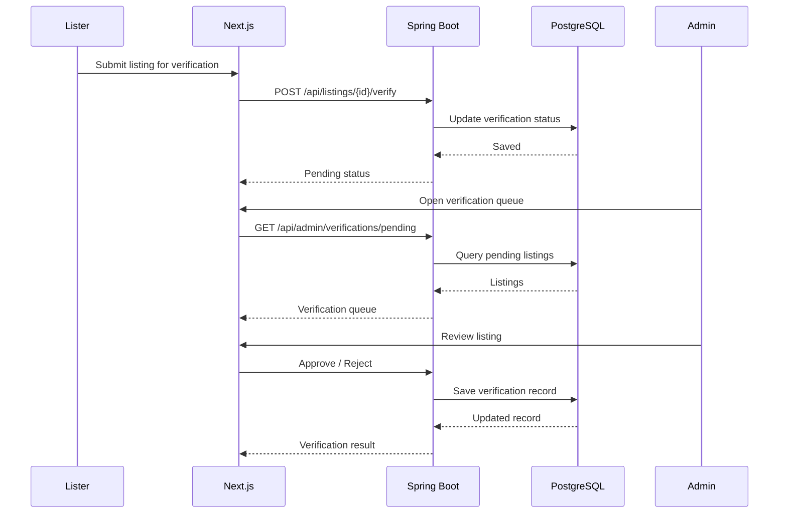

When a property is approved, CampusNest creates a verification record containing information such as:

- property ID
- lister ID
- verification status
- record hash
- timestamp
- reviewer ID
- optional blockchain transaction

For approved properties, the backend computes a canonical SHA-256-based verification hash.

Blockchain registration is optional and disabled by default in the local configuration. When enabled and correctly configured, the application can register verification information through the Polygon Amoy network.

---

# Smart Recommendations

CampusNest currently uses a **deterministic five-factor recommendation algorithm** rather than an unpredictable generative model.

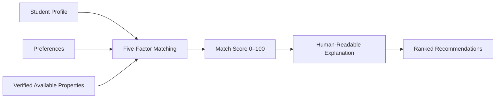

The current weighting is:

| Factor | Weight |
|---|---:|
| Budget | 30% |
| Distance | 25% |
| Trust / Verification | 20% |
| Facilities | 15% |
| Lifestyle | 10% |

### Budget — 30%

Compares the property's effective monthly cost with the student's budget range.

### Distance — 25%

Uses distance from campus to assign a score based on proximity.

### Trust — 20%

Verified properties receive the highest trust score.

### Facilities — 15%

Property facilities are matched against available requirements.

### Lifestyle — 10%

Student lifestyle tags are compared against property facilities, description, and locality.

The final score is normalized to a 0–100 range and sorted to produce recommendations.

Recommendation explanations are currently deterministic Java-generated explanations. The optional OpenAI configuration exists, but the recommendation explanation does not depend on an OpenAI call.

---

# Authentication & Authorization

CampusNest uses **stateless JWT authentication**.

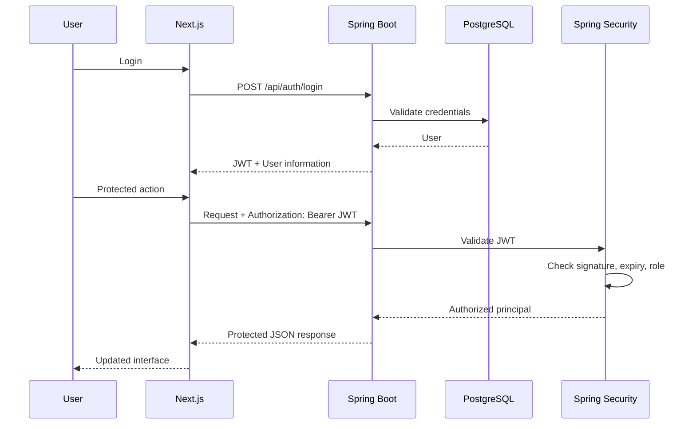

### Registration

```http
POST /api/auth/register
```

A new account can be registered as:

- `STUDENT`
- `LISTER`

Admin registration is intentionally not exposed through normal registration.

### Login

```http
POST /api/auth/login
```

The backend returns a signed JWT containing authenticated user information.

### Password security

Passwords are encoded using BCrypt and are never stored as plain text.

---

# Data & Privacy

CampusNest handles several categories of information.

| Category | Examples | Purpose |
|---|---|---|
| Public Listing Data | Property name, locality, rent, facilities | Property discovery |
| Private User Data | Email, account information, phone where applicable | Authentication and platform operation |
| Student Preferences | Budget, college, locality, lifestyle tags | Recommendation matching |
| Verification Data | Hashes, timestamps, reviewer IDs, transaction IDs | Property verification and auditability |
| System Data | Authentication and operational records | Platform security and administration |

The Admin portal masks user contact information where appropriate.

CampusNest does not expose passwords, password hashes, JWT secrets, or database credentials through the frontend Admin interface.

> The current project should not be interpreted as claiming formal GDPR, DPDP, or other regulatory compliance unless additional compliance controls are implemented.

---

# Tech Stack

| Layer | Technology |
|---|---|
| Frontend | Next.js 16, React 19, TypeScript |
| Styling | Tailwind CSS 4 |
| UI Utilities | clsx, tailwind-merge, lucide-react |
| Animation | Framer Motion |
| Backend | Spring Boot 3.5.x, Java 25 |
| REST API | Spring Web / MVC |
| Security | Spring Security |
| Authentication | JWT / JJWT 0.12.6 |
| Password Hashing | BCrypt |
| ORM | Spring Data JPA / Hibernate |
| Database | PostgreSQL 16 |
| Testing Database | H2 |
| Migrations | Flyway |
| Blockchain | Web3j 4.12.2 |
| Blockchain Network | Polygon Amoy when enabled |
| API Documentation | Springdoc OpenAPI |
| Backend Build | Maven / Maven Wrapper |
| Frontend Build | npm / Next.js |

---

# Prerequisites

Before running CampusNest locally, install:

| Requirement | Purpose |
|---|---|
| Git | Clone the repository |
| Java 25 | Run the Spring Boot backend |
| Node.js | Run the Next.js frontend |
| npm | Frontend dependencies |
| Docker Desktop | Recommended for local PostgreSQL |
| PostgreSQL 16 | Required if not using Docker |

The backend includes a Maven Wrapper, so a globally installed Maven installation is not required.

---

# Local Development

## 1. Clone the repository

```bash
git clone https://github.com/adnanwho/CampusNest.git
cd CampusNest
```

## 2. Start PostgreSQL

The repository includes Docker Compose configuration.

```bash
docker compose up -d postgres
```

The default local configuration maps:

```text
Host:     127.0.0.1
Port:     5433
Database: campusnest
Username: campusnest
Password: campusnest
```

Check the database container:

```bash
docker compose ps
```

## 3. Start the backend

Windows:

```powershell
cd backend
.\mvnw.cmd spring-boot:run
```

macOS/Linux:

```bash
cd backend
./mvnw spring-boot:run
```

The backend runs at:

```text
http://localhost:8080
```

The API context path is:

```text
/api
```

Therefore the API base URL is:

```text
http://localhost:8080/api
```

## 4. Start the frontend

Open another terminal:

```bash
cd web
npm install
npm run dev
```

The Next.js development server runs at:

```text
http://localhost:3000
```

## 5. Open CampusNest

```text
http://localhost:3000
```

---

# Optional H2 Development Profile

For lightweight backend testing, the project contains an H2 profile.

From `backend`:

```powershell
.\mvnw.cmd spring-boot:run -Dspring-boot.run.profiles=h2
```

This uses an in-memory H2 database configured for PostgreSQL compatibility.

For the normal application/demo environment, PostgreSQL is the intended database.

---

# Environment Variables

The repository includes `.env.example`.

## Database

```env
DATABASE_URL=jdbc:postgresql://127.0.0.1:5433/campusnest
DB_USERNAME=campusnest
DB_PASSWORD=campusnest
```

## JWT

```env
JWT_SECRET=change-this-to-a-long-random-secret-key-for-production
JWT_EXPIRATION_MS=86400000
```

For production, replace the development JWT secret with a long, random secret.

## Frontend

```env
NEXT_PUBLIC_API_URL=http://localhost:8080/api
```

## Optional OpenAI

```env
OPENAI_API_KEY=
```

The application has deterministic fallback recommendation explanations when the key is not configured.

## Optional Blockchain

```env
BLOCKCHAIN_ENABLED=false
BLOCKCHAIN_PRIVATE_KEY=
BLOCKCHAIN_RPC_URL=https://rpc-amoy.polygon.technology
CONTRACT_ADDRESS=
CHAIN_NETWORK=Polygon Amoy
CHAIN_EXPLORER_URL=https://amoy.polygonscan.com
```

Blockchain functionality is disabled by default.

## Admin seed

```env
ADMIN_EMAIL=admin@campusnest.demo
ADMIN_PASSWORD=admin123
ADMIN_NAME=CampusNest Admin
```

These values are development/showcase defaults. Replace them for any real deployment and never commit production credentials.

---

# API Reference

The backend uses `/api` as its context path.

## Authentication

| Method | Endpoint | Auth | Description |
|---|---|---|---|
| POST | `/api/auth/register` | Public | Register a Student or Lister |
| POST | `/api/auth/login` | Public | Authenticate and receive a JWT |

## Student

| Method | Endpoint | Auth | Description |
|---|---|---|---|
| GET | `/api/students/me` | STUDENT | Read current student profile |
| PUT | `/api/students/me` | STUDENT | Update current student profile |

## Properties

| Method | Endpoint | Auth | Description |
|---|---|---|---|
| GET | `/api/properties` | STUDENT | Search verified available properties |
| GET | `/api/properties/{id}` | STUDENT | View property details |
| POST | `/api/properties/compare` | STUDENT | Compare 2–3 properties |
| GET | `/api/recommendations` | STUDENT | Get personalized recommendations |

## Lister

| Method | Endpoint | Auth | Description |
|---|---|---|---|
| GET | `/api/listings/mine` | LISTER | Get current lister's properties |
| POST | `/api/listings` | LISTER | Create a property |
| PUT | `/api/listings/{id}` | LISTER | Update an owned listing |
| PUT | `/api/listings/{id}/availability` | LISTER | Update occupancy/availability |
| POST | `/api/listings/{id}/verify` | LISTER | Submit listing for verification |

## Admin

| Method | Endpoint | Auth | Description |
|---|---|---|---|
| GET | `/api/admin/dashboard` | ADMIN | Dashboard metrics |
| GET | `/api/admin/users` | ADMIN | User administration data |
| GET | `/api/admin/properties` | ADMIN | Property administration data |
| GET | `/api/admin/privacy` | ADMIN | Data/privacy overview |
| GET | `/api/admin/consent` | ADMIN | Consent-oriented records |
| GET | `/api/admin/audit-logs` | ADMIN | Audit activity |
| GET | `/api/admin/reports` | ADMIN | Marketplace reports |
| GET | `/api/admin/system-health` | ADMIN | System health information |

## Admin Verification

| Method | Endpoint | Auth | Description |
|---|---|---|---|
| GET | `/api/admin/verifications/pending` | ADMIN | Pending/under-review listings |
| GET | `/api/admin/verifications/all` | ADMIN | All properties for verification view |
| POST | `/api/admin/verifications/{id}/review` | ADMIN | Mark listing under review |
| POST | `/api/admin/verifications/{id}/approve` | ADMIN | Approve listing |
| POST | `/api/admin/verifications/{id}/reject` | ADMIN | Reject listing with reason |

## Public Verification

| Method | Endpoint | Auth | Description |
|---|---|---|---|
| GET | `/api/verification/{propertyId}` | Public | Read latest verification record |

---

# API Documentation

Springdoc OpenAPI is included in the backend.

When the backend is running, Swagger UI is available at:

```text
http://localhost:8080/api/swagger-ui/index.html
```

OpenAPI JSON:

```text
http://localhost:8080/api/v3/api-docs
```

---

# Project Structure

```text
CampusNest/
├── backend/
│   ├── .mvn/
│   │   └── wrapper/
│   ├── src/
│   │   ├── main/
│   │   │   ├── java/
│   │   │   │   └── com/
│   │   │   │       └── campusnest/
│   │   │   │           ├── admin/
│   │   │   │           ├── auth/
│   │   │   │           ├── blockchain/
│   │   │   │           ├── common/
│   │   │   │           ├── config/
│   │   │   │           ├── lister/
│   │   │   │           ├── model/
│   │   │   │           ├── property/
│   │   │   │           ├── recommendation/
│   │   │   │           ├── repository/
│   │   │   │           ├── student/
│   │   │   │           └── verification/
│   │   │   └── resources/
│   │   │       ├── db/
│   │   │       │   └── migration/
│   │   │       └── application.yml
│   │   └── test/
│   ├── pom.xml
│   ├── mvnw
│   └── mvnw.cmd
│
├── web/
│   ├── src/
│   │   ├── app/
│   │   │   ├── admin/
│   │   │   ├── lister/
│   │   │   ├── student/
│   │   │   ├── login/
│   │   │   ├── register/
│   │   │   └── page.tsx
│   │   ├── components/
│   │   │   └── shared/
│   │   └── lib/
│   ├── public/
│   ├── package.json
│   ├── package-lock.json
│   └── next.config.ts
│
├── docker-compose.yml
├── .env.example
├── AGENTS.md
├── CHANGELOG.md
├── implementation_plan.md
├── PRD_extracted.txt
└── CAMPUSNEST_JUDGE_GUIDE.txt
```

### Backend packages

| Package | Responsibility |
|---|---|
| `auth` | Registration, login, JWT, password security |
| `student` | Student profile operations |
| `lister` | Listing creation, editing, occupancy and verification submission |
| `property` | Property search, details, comparison |
| `recommendation` | Deterministic recommendation scoring |
| `admin` | Administrative operations and verification |
| `verification` | Public verification lookup |
| `blockchain` | Hashing and optional blockchain registration |
| `repository` | Spring Data persistence |
| `model` | JPA entities and enums |
| `common` | Shared cost, availability and tag logic |
| `config` | Application configuration and data seeding |

### Frontend routes

```text
/
├── /login
├── /register
├── /student
│   ├── /search
│   ├── /compare
│   ├── /profile
│   └── /property/[id]
├── /lister
│   ├── /add
│   └── /[id]/edit
└── /admin
```

The Admin interface currently uses an operations-style dashboard with sections for:

- Overview
- Verification Queue
- Properties
- User Accounts
- Data & Privacy
- User Consent
- Audit Logs
- Analytics & Reports
- System Health

---

# How It Works

## 1. Student Property Discovery

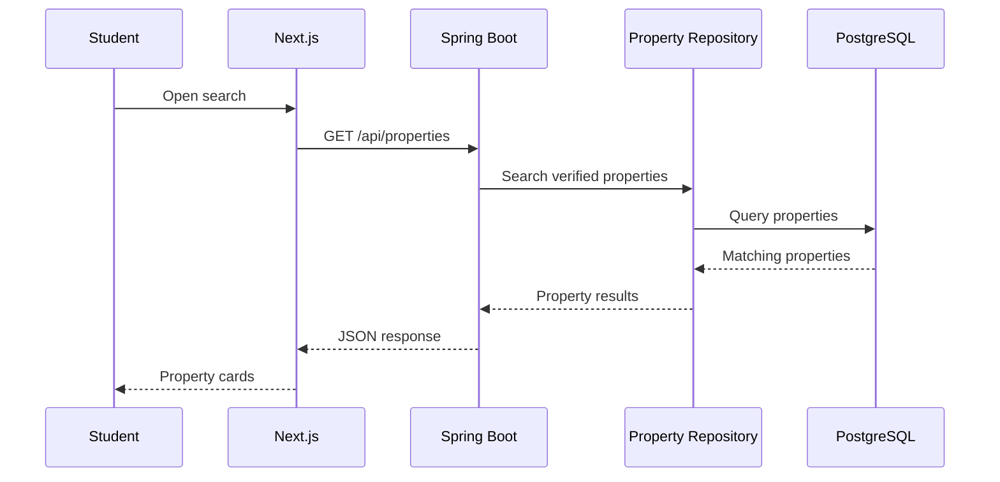

The property search applies the requested filters and only returns properties that satisfy the platform's verification and availability requirements.

---

## 2. Recommendation Flow

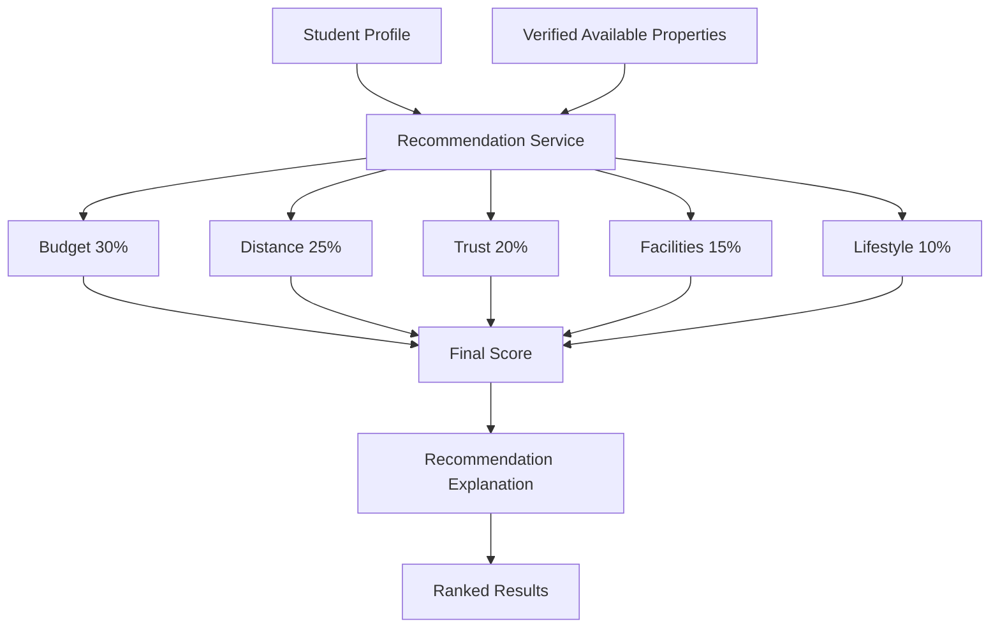

The matching system is deterministic and produces repeatable scores from the same profile and property information.

---

## 3. Lister Listing Flow

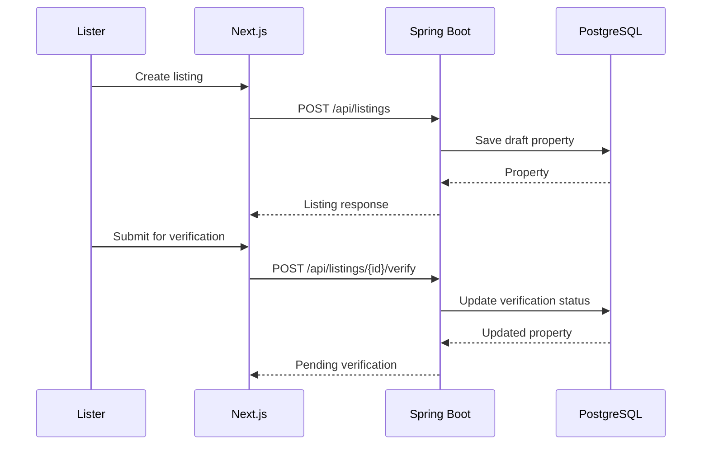

---

## 4. Admin Verification Flow

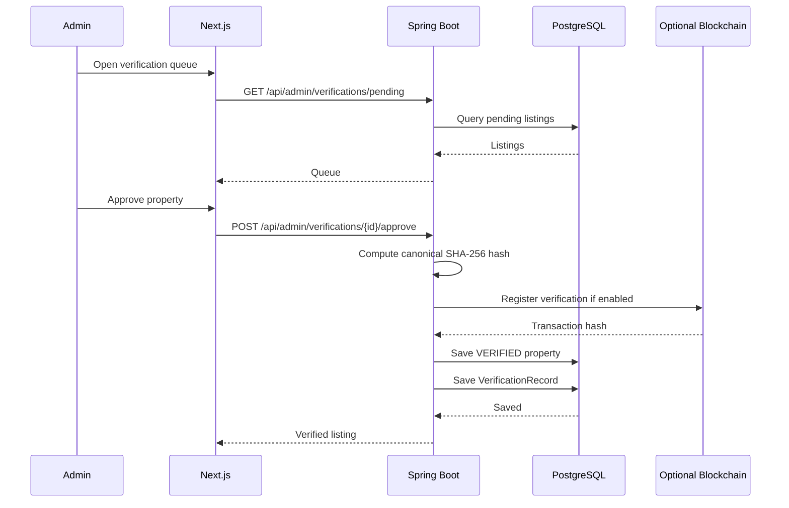

---

# Database Model

CampusNest uses PostgreSQL with JPA/Hibernate and Flyway-managed schema migrations.

The core domain entities include:

- `User`
- `StudentProfile`
- `ListerProfile`
- `Property`
- `Review`
- `VerificationRecord`

A simplified relationship view is:

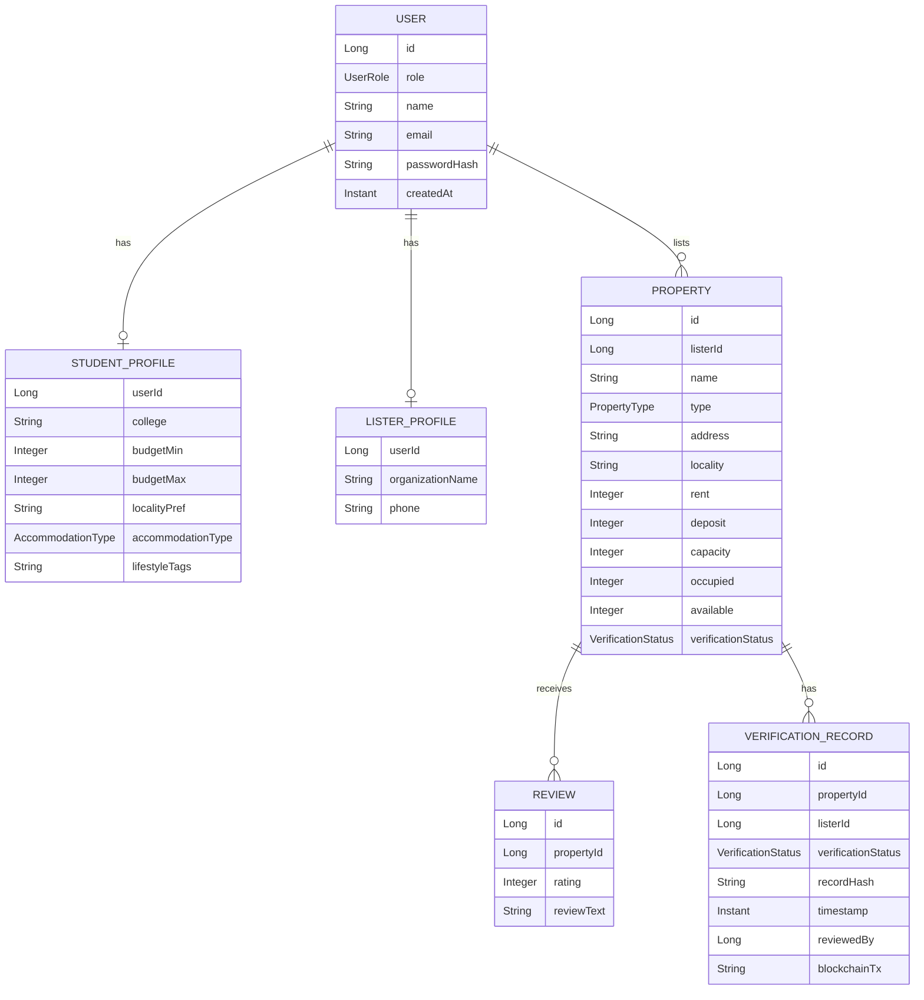

The diagram is intentionally simplified; implementation-specific fields may exist beyond the core relationships shown here.

---

# Deployment

CampusNest currently provides a local development configuration with:

- Next.js frontend
- Spring Boot backend
- PostgreSQL database
- optional H2 development profile
- optional Polygon Amoy blockchain integration

Production deployment should provide separate secure configuration for:

- database credentials
- JWT secret
- CORS origins
- blockchain credentials
- frontend API URL
- optional OpenAI API key

Do not use the development credentials from `.env.example` in a production deployment.

---

# Recommended Showcase Flow

For a live demonstration, the following order tells the CampusNest story clearly.

## Student Experience

### 1. Landing page

Introduce the accommodation problem and CampusNest's solution.

### 2. Student registration/login

Create or use a Student account.

### 3. Student profile

Show:

- college
- budget
- locality
- accommodation type
- lifestyle preferences

### 4. Discover / Search

Demonstrate:

- locality filtering
- budget filtering
- property type filtering
- availability

### 5. Recommendations

Show the match score and explain how the five factors affect ranking.

### 6. Property details

Highlight:

- effective monthly cost
- availability
- facilities
- distance
- commute
- verification information

### 7. Compare

Compare multiple properties side-by-side.

---

## Lister Experience

### 8. Lister login

Enter the Lister portal.

### 9. Create a listing

Enter property information and pricing.

### 10. Update availability

Show occupied and available beds.

### 11. Submit for verification

Send the property into the Admin verification queue.

---

## Admin Experience

### 12. Admin login

Enter the secure Admin portal.

### 13. Dashboard

Show:

- student count
- lister count
- property count
- verification queue
- capacity
- occupancy
- system status

### 14. Verification Queue

Open the listing submitted by the Lister.

### 15. Inspect and approve/reject

Demonstrate the verification workflow.

### 16. Verification record

Show:

- status
- hash
- timestamp
- reviewer
- blockchain transaction when configured

### 17. Data & Privacy

Show what platform data is available to authorized administrators.

### 18. Audit Logs / Reports

Show operational history and marketplace analytics.

### 19. Role isolation

Attempt to access `/admin` as a Student or Lister and demonstrate that Admin access is protected.

---

# Project Status

## Implemented

- Student registration and login
- Lister registration and login
- Admin authentication/seed account
- JWT authentication
- Spring Security role authorization
- Student profile management
- Lister property management
- Property search and filtering
- Property details
- Property comparison
- Deterministic recommendations
- Live property availability
- Admin verification queue
- Property approval/rejection
- Verification records
- SHA-256 verification hashing
- Admin dashboard
- Admin users overview
- Admin property overview
- Data & Privacy dashboard
- User Consent dashboard
- Audit Logs
- Analytics & Reports
- System Health
- PostgreSQL persistence
- Flyway migrations
- H2 development profile
- Swagger/OpenAPI
- Optional Polygon Amoy blockchain integration
- Next.js frontend

## Optional / Configuration-Dependent

- Polygon Amoy blockchain transactions
- OpenAI configuration

## Planned / Future Improvements

Potential future work can include:

- richer property media and document verification
- more granular consent management
- expanded audit persistence
- production deployment
- advanced analytics
- richer recommendation models
- additional notification and communication features

Future features should not be interpreted as currently implemented functionality.

---

# Contributing

Contributions are welcome.

1. Fork the repository.
2. Create a feature branch.

```bash
git checkout -b feature/your-feature
```

3. Make your changes.
4. Run the relevant tests and build commands.
5. Commit your changes.

```bash
git add .
git commit -m "feat: describe your change"
```

6. Push your branch.

```bash
git push origin feature/your-feature
```

7. Open a Pull Request.

For larger changes, describe the architectural or behavioral impact in the Pull Request.

---

# License

No license is currently specified in the repository.

---

## CampusNest at a Glance

```text
                 ┌─────────────────────────┐
                 │       CAMPUSNEST        │
                 │ Student Accommodation   │
                 └────────────┬────────────┘
                              │
          ┌───────────────────┼───────────────────┐
          │                   │                   │
          ▼                   ▼                   ▼
     ┌──────────┐       ┌──────────┐       ┌──────────┐
     │ STUDENT  │       │  LISTER  │       │  ADMIN   │
     ├──────────┤       ├──────────┤       ├──────────┤
     │ Discover │       │ Create   │       │ Verify   │
     │ Search   │       │ Manage   │       │ Users    │
     │ Match    │       │ Update   │       │ Data     │
     │ Compare  │       │ Submit   │       │ Audit    │
     │ Verify   │       │ Verify   │       │ Reports  │
     └────┬─────┘       └────┬─────┘       └────┬─────┘
          │                  │                  │
          └──────────────────┼──────────────────┘
                             ▼
                    ┌─────────────────┐
                    │  Spring Boot   │
                    │ REST API / JWT │
                    │ RBAC / Services│
                    └────────┬────────┘
                             │
                             ▼
                    ┌─────────────────┐
                    │   PostgreSQL   │
                    │   + Flyway     │
                    └─────────────────┘
```

**CampusNest — discover better, verify with confidence.**
